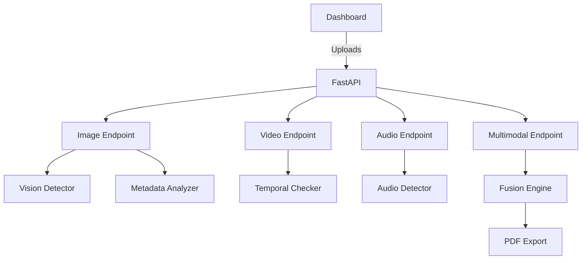

# Deepfake Detection System (DFS)

An educational, privacy-preserving Deepfake Detection System built with FastAPI and a lightweight dashboard. DFS simulates vision, temporal, audio, and metadata detectors, then fuses their outputs into a comprehensive risk assessment for training and governance demonstrations.

## Repository Status
- **Stack:** FastAPI backend, static JS dashboard, numpy/Pillow heuristics
- **Safety:** Local-only processing, executable upload blocking, no biometric storage, synthetic defaults
- **Quality:** CI (ruff, black, mypy, pytest), Docker image, Makefile for developer ergonomics

## Repository Tree
```
.
├── .devcontainer/        # VS Code dev container for reproducible environments
├── backend/               # FastAPI app, routers, engines, utilities
├── frontend/              # Static dashboard assets
├── docs/                  # Architecture, API reference, operations
├── data/                  # Synthetic sample space (user-provided only)
├── logs/                  # Reports and log outputs (not committed)
├── tests/                 # Pytest suite
├── requirements*.txt      # Runtime and dev dependencies
├── pyproject.toml         # Tooling configuration (ruff, black, mypy)
├── Dockerfile             # Container build for the API
├── Makefile               # Common tasks: lint, test, run
└── README.md              # Project overview
```

## Architecture


## Features
- Image, video, and audio ingestion with preprocessing, face detection, and alignment.
- Vision detector using lightweight texture and lighting heuristics plus artifact heatmap generation.
- Temporal consistency analysis for frame jitter, blink anomalies, and shadow drift (simulated).
- Audio forensics with MFCC-based anomaly checks (synthetic and safe).
- Metadata/EXIF analyzer for spoof detection and editing traces.
- Multimodal fusion engine with risk classification and confidence estimation.
- FastAPI backend with endpoints for each modality and a dashboard served from `/dashboard`.
- PDF report generation for compliance and audit trails.

## Getting Started
### Prerequisites
- Python 3.10+
- (Optional) Docker for containerized runs
- (Optional) VS Code Dev Containers for a hermetic workspace

### Local Setup
```bash
make install
make run
```
Open the dashboard at [http://localhost:8000/dashboard](http://localhost:8000/dashboard).

### VS Code Dev Container
```bash
devcontainer open .
```
The workspace installs dev dependencies automatically and applies the configured tooling.

### Quality Gates
```bash
make lint
make typecheck
make test
```

### Docker
```bash
make docker-build
make docker-run
```
Access the service at `http://localhost:8000/dashboard`.

## API Overview
See [docs/api.md](docs/api.md) for request/response schemas and examples.
- `GET /health` – Service health probe.
- `POST /analyze_image` – Analyze a single image file.
- `POST /analyze_video` – Analyze video bytes for temporal anomalies.
- `POST /analyze_audio` – Analyze audio clips for synthetic patterns.
- `POST /analyze_multimodal` – Fuse available modalities.

Payloads are multipart form uploads with `file` fields matching endpoint expectations.

## Documentation
- [docs/architecture.md](docs/architecture.md) – component breakdown and data flow
- [docs/api.md](docs/api.md) – endpoint reference
- [docs/operations.md](docs/operations.md) – runbooks, Docker usage, and QA steps
- [docs/threat_model.md](docs/threat_model.md) – threat model, mitigations, and controls

## Safety & Privacy
- Only synthetic or user-provided media is accepted; no external lookups or biometric storage.
- Blocking of executable uploads via filename validation.
- Logging avoids sensitive payload data and focuses on operational metadata.
- Reports remain local under `logs/`; enforce access controls and rotate artifacts.

## Extensibility
- Swap heuristics in `backend/engines` for real detectors or ONNX/TFLite models.
- Extend preprocessing in `backend/utils/preprocess.py` for additional modalities.
- Update fusion weights in `backend/engines/fusion_engine.py` to reflect new signals.

## Compliance Mapping
- **ISO/IEC 42001**: risk management (fusion risk levels), monitoring (logs), documentation (reports).
- **NIST AI RMF**: govern (policies in SECURITY.md), map (threat landscape in docs/architecture.md), measure (scores), manage (reports & dashboards).

## Limitations
- Detectors are heuristic and not a substitute for production-grade forensic pipelines.
- Video extraction is simulated; use a proper decoder for real workloads.
- Audio MFCCs are simplified; integrate libraries like `librosa` for robust features.

## License
MIT License. See [LICENSE](LICENSE).
